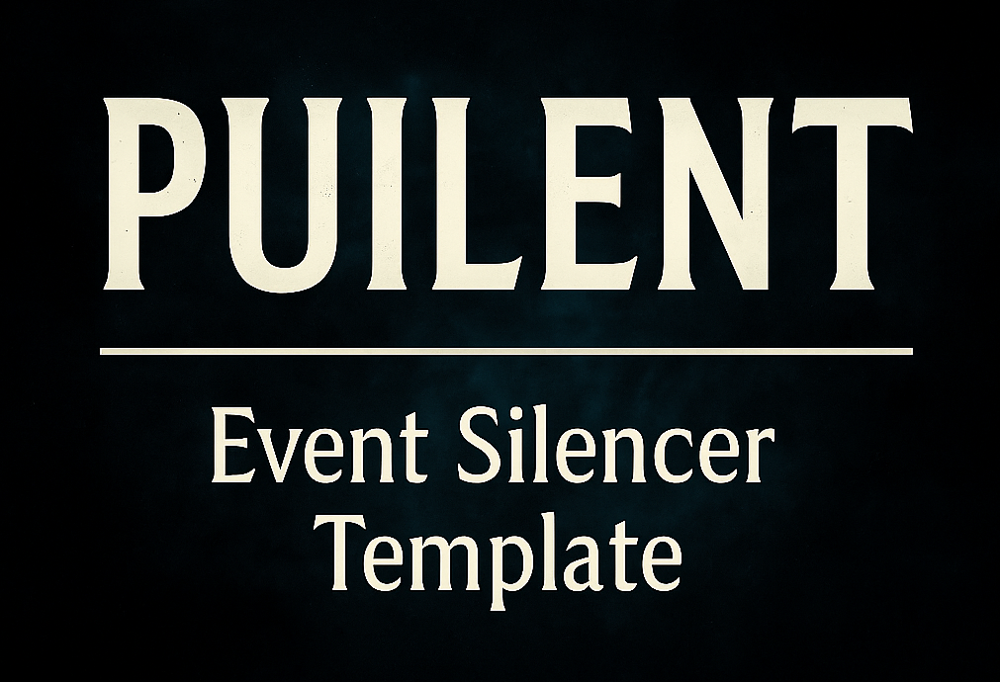

# PUILENT — The Ultimate Event Silencer Tool for Stellaris

  
*Silence the noise. Command your galaxy.*

---

## What is PUILENT?

**PUILENT** is a lightweight, plug-and-play **Tool** for Stellaris that **silences any annoying event** with zero hassle.  
No more digging through folders, no more manual file edits—just smooth, peaceful galactic domination.

---

## Features

- Instantly silence any Stellaris event by overriding it—no coding required  
- Modular and user-friendly GUI for effortless event management  
- Automatically handles folder structure and load order placement like a pro  
- Perfect for modders, players, and anyone sick of spammy pop-ups  
- Debug broken mods or keep your game neat and quiet  
- Minimal setup—launch, click, silence. Like flipping a switch on a Soviet-era generator

---

## How to Use

1. Start Stellaris and open the console (`~` key)  
2. Enable **Debug Tooltip** mode by typing `debugtooltip` or using the console’s quick actions  
3. Hover over the **OK button** of the event to get its event ID  
4. Open **PUILENT GUI Tool**  
5. Add, edit, or remove event IDs with a few clicks  
6. PUILENT auto-creates folders, checks for conflicting mods, and sets load order so you don’t have to — like a well-trained comrade

---

## License and Distribution

Open source and free as the Siberian wind. Use it, modify it, share it—just keep my name on it, comrade.  
PUILENT belongs to the people.

---

## Credits

- Mod Author: **Envika Chan**  
- Inspired by frustration with noisy Stellaris events and too much manual work

---

## Contact

Bug reports, ideas: [GitHub Issues](https://github.com/Envika/PUILENT-Event-Silencer-Template-For-Stellaris/issues)  
Happy modding, and may your galaxy stay silent as a KGB archive.
